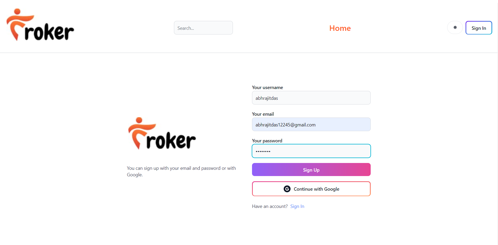
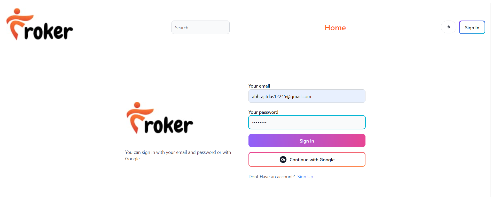
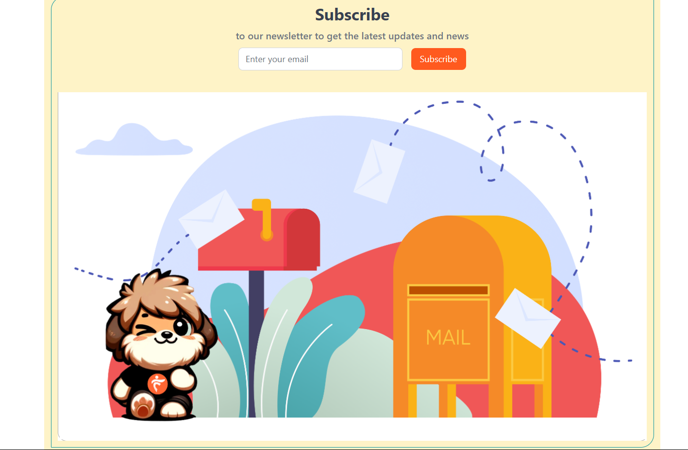
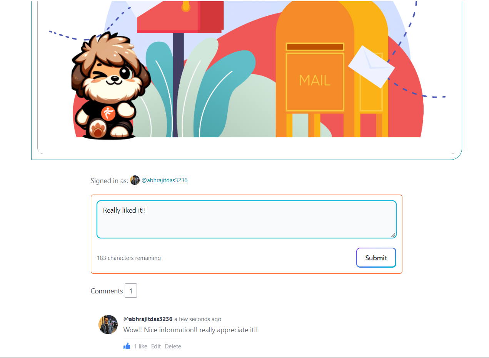

<h1 align="center">Blog Website</h1>
<h5 align="center">"An interactive Content Publishing Website"</h5>

<hr>


# Project Overview

An online platform where individuals or groups publish content on various topics in a reverse chronological order with the most recent posts appearing first. It contains features like text, images in their blogs. Readers can like and leave comments.
This project uses ReactJs(Vite) for the frontend and NodeJs(Express) for Backend Server and MongoDb as Database. 

# Web Application

This javascript based application allows users to create an account on the site, browse though all the post , comment on the posts  ,edit and like the comments.

Users can read,like and comment the blogs in the website. It also has the features of Sign-in nad Sign-up taking care of the privacy of the users also allowing the users to read blogs anonymously.Moreover has the edit options and comment section for sharing one's thought on the topic.It also inlcudes the Suscribe to Newsletter feature.

<!---->

## Documentation
Frontend-

[ReactJs](https://react.dev/blog/2023/03/16/introducing-react-dev)
[Redux](https://redux.js.org/)
[TailwindCss](https://v2.tailwindcss.com/docs)


Backend-

[ExpressJs](https://devdocs.io/express/)
[MongoDb](https://www.mongodb.com/docs/)


## Environment Variables

To run this project, you will need to add the following environment variables to your .env file.

For BACKEND (In Root Directory)-

`MONGO`

`JWT_SECRET`

For FrontEnd (Inside client Folder)-

`VITE_FIREBASE_API_KEY`

## Node modules installation

To install the node modules used in the project,

```bash
  npm i 
```
or

```bash
  npm install 
```

in both client directory (frontend) &
in root directory(backend server)


## Run Command

To run this project in local server,

```bash
  npm run dev
```
in both client directory (frontend) &
in root directory(backend server)

## TECHNOLOGY STACK

FRONTEND


 

BACKEND


## Features

- Login Page via email-password or Firebase 
 


- Active DashBoard for Users


- A customised search layout to search required post as and when needed


- Subscribe to Newsletter

 

- Commments,Edits,Like ,Delete added for comments.


- Backend encrypted database for user details,posts,comment.



- Recent articles feature


## Deployment

Deployed on Render: https://froker-blog.onrender.com

